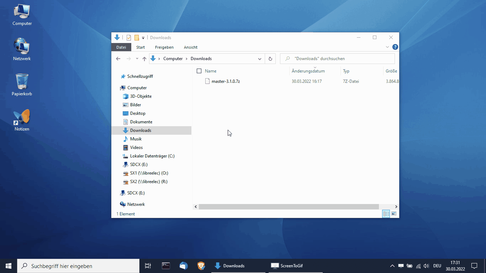

   
  
  

# Description
Since about 2010, there is the project of virtual environment with modular
structure for developers and users, so that they can use a completely
pre-configured environment with all programs, tools and services, without the
host environment interfering with the running operating system and devouring
resources.

Short setup times, uniform tools with uniform configuration, uniform paths in
the file system, centralized maintenance and easy distribution and updating are
some of the benefits. The environment is easily customizable, can be quickly
switched to use for different projects, and the environment can be easily
transferred to other machines where work started can be continued.

__The project includes with [platform](platform), a tool for the initial
creation, use and management of the virtual environment and a
[module concept](modules) for the automatic integration and configuration of
tools and programs from any source on the Internet.__

__The module concept is a successful PoC (proof of concept), but is not
currently the focus of the project. So the software has to be set up manually
in the virtual environment, but that's easy because it's a normal drive.__

Since in large companies the strict use of BitLocker is often required, this is
also supported.

__What is the difference with PortableApps.com or portapps.io?__

The virtual environment focuses on the virtual drive as a platform. It is about
the advantages that the platform can be used as a single file and programs and
services can be used in it with a complete configuration and with reliable
absolute paths.

The integration and distribution of portable applications are not the ambition
of this project.

The use of modules for the integration of programs and services is planned, but
is more an exemplification of the possibilities for the integration of programs
and services. However, it is not the intention of the project to establish a
corresponding eco-system or repository.

[PortableApps.com](https://portableapps.com/apps) and
[portapps.io](https://portapps.io/apps) complement the virtual environment
perfectly and both release very good portable versions of programs that can be
used in the virtual environment.

## Advantages
- A virtual drive is used, which contains all data in one file.
- The drives can also be supplied and used via the network.
- Only one large file can be copied faster and also shared.
- Snapshots and versioning are possible.
- Multiple drives with different environments can be used in parallel on one computer. 
- Fast switching between different drives and environments is possible.
- Fixed drive letters and paths are used.
- The use of the file system and registry from the host is avoided.
- Environments can be maintained and distributed centrally.
- A team use the same environment with the same paths and configurations, which facilitates automation.

# Features
- Supports VHD, VHDX as virtual drive also with Bitlocker
- Functions to create, launch, manage and compact the environment
- The environment is immediately usable after creation
- Integrated program launcher with optimized keyboard support for fast program access
- Personalization of the environment and programs through the use of a separate
  key-values file
- Option to improve multitasking of older CPUs
- Very small and resource-saving implementation of the platform
- The use of the local file system and the registry is avoided
- Easy customization according to the requirements
- Simplifies centralized maintenance and distribution
- Simplifies automation

# Licence Agreement
LIZENZBEDINGUNGEN - Seanox Software Solutions ist ein Open-Source-Projekt, im
Folgenden Seanox Software Solutions oder kurz Seanox genannt.

Diese Software unterliegt der Version 2 der Apache License.

Copyright (C) 2022 Seanox Software Solutions

Licensed under the Apache License, Version 2.0 (the "License"); you may not use
this file except in compliance with the License. You may obtain a copy of the
License at

https://www.apache.org/licenses/LICENSE-2.0

Unless required by applicable law or agreed to in writing, software distributed
under the License is distributed on an "AS IS" BASIS, WITHOUT WARRANTIES OR
CONDITIONS OF ANY KIND, either express or implied. See the License for the
specific language governing permissions and limitations under the License.

# System Requirement
- Windows 10 or higher
- .NET 4.7.x or higher

# Downloads
[Seanox Virtual Environment 3.2.0](https://github.com/seanox/virtual-environment/releases/download/3.2.0/seanox-virtual-platform-3.2.0.zip)  
[Seanox Virtual Environment 3.2.0 Update](https://github.com/seanox/virtual-environment/releases/download/3.2.0/seanox-virtual-platform-3.2.0-update.zip) for existing environment

## Example
Here you can download an example of a virtual environment (approx __3.9 GB__ / last update 2022-09-03):  
https://seanox.com/storage/master-3.2.1.7z 

Included are various development environment and tools for Java and Node.js,
incl. a customized Eclipse, a PostgreSQL database and much more.

Start `master.exe B: attach`.

The host key combination for the launcher: `Win + ESC`

To exit, use the Detach button at the bottom right of the launcher.

# Usage
- Download the last release of [seanox-virtual-platform.zip](#downloads)
- Extract the file to any location in the local file system
- Rename __platform.exe__ to the name that will be used for the environment and drive

Then the program can be used as follows::

`usage: platform.exe A-Z: [create|attach|detach|compact|shortcuts]  `

Example
- `platform.exe B: create` to create the initial environment as VHDX
- `platform.exe B: shortcuts` to create the usual calls as shortcuts
- `platform.exe B: attach` to attach the environment

Configure __Startup.cmd__ in the root directory of the virtual environment and
add the desired programs and services. It is recommended to use a launcher so
that the environment variables are available to the called programs. Detach
should also be started via the launcher if programs and services are terminated
when detaching and the environment variables are needed for this.

- `platform.exe B: detach` to detach the environment
- `platform.exe B: compact` to compact the virtual disk

__Module integration will come later, but will be similar.__

# Changes
## 3.2.0 20220625  
BF: Build: Correction of the release info process  
BF: Launcher: Correction of the behavior when the screen resolution changes  
CR: Platform: Optimization when detaching / process termination  
CR: Platform: Integrated settings as a core component  
CR: Launcher: Scaling of icons depending on screen resolution (aesthetic reasons)  
CR: Launcher: Increase from the default value of OPACITY (95)  
CR: Launcher: Added option AutoScale (default true)  
CR: Shiftdown: Change the location to /Program Portables/ShiftDown  

[Read more](https://raw.githubusercontent.com/seanox/virtual-environment/main/CHANGES)

# Contact
[Issues](https://github.com/seanox/virtual-environment/issues)  
[Requests](https://github.com/seanox/virtual-environment/pulls)  
[Mail](http://seanox.de/contact)
