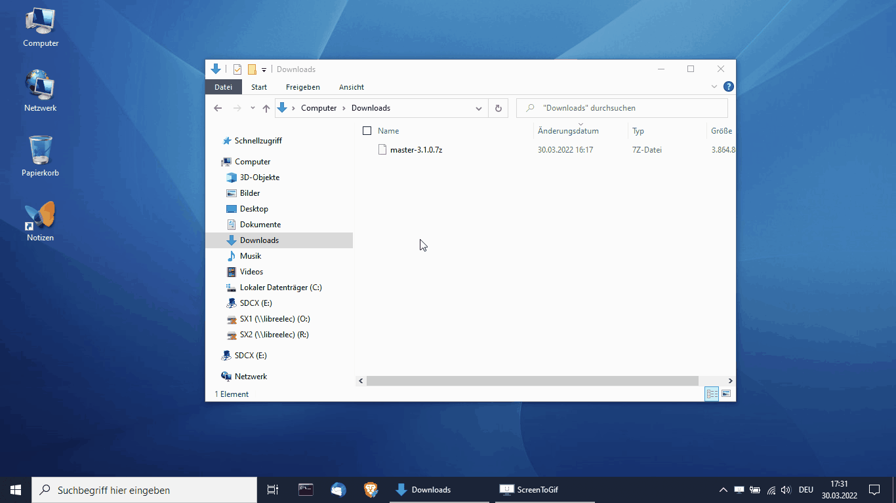

<p>
  <a href="https://github.com/seanox/virtual-environment/pulls"
    title="Open for contributions, ideas and enhancements"
    ></a>
  <!--
  <a href="https://github.com/seanox/virtual-environment/pulls"
    title="Development is waiting for contributions, ideas and enhancements"
    ></a>
  -->
  <a href="https://github.com/seanox/virtual-environment/issues"
    title="Open for issues and feature requests"
    ></a>
  <a href="https://seanox.com/contact" title="Contact for questions and support"
    ></a>
</p>

# Description
The workspace project provides a portable, file-based working environment with a
modular structure for developers and users. It allows tools, applications and
services to run within a self-contained workspace using predefined paths and
configurations, while attempting to avoid changes to the host system.

Stored on a virtual disk, the workspace can be attached, detached and
transferred between Windows installations on different machines. A Windows-based
abstraction layer handles the mounting and management of this disk, allowing all
operations to take place within the logically isolated workspace. Path,
configuration and environment separation are used to maintain consistent runtime
conditions and reduce unintended interaction with the host file system and
registry.
	
__The project consists of the [platform](platform), the [launcher](launcher) and
the [startup tool](startup). The platform manages virtual disks (creation,
attachment, detachment, maintenance). The launcher provides keyboard-based
access to programs inside the workspace, and the startup tool initializes
services and applications. A [module concept](modules) for integrating external
tools exists as a proof of concept but is not the current focus of
development.__

BitLocker-encrypted virtual disks are supported for environments where
encryption requirements apply.

__Difference to [PortableApps.com](https://portableapps.com) and [portapps.io](
    https://portapps.io)__

This project focuses on the virtual drive as the execution platform.
Applications and services run inside the virtual drive with defined paths and
configurations. The goal is not to provide portable applications, but to offer a
complete, logically isolated workspace that can be used as a single file.

[PortableApps.com](https://portableapps.com) and [portapps.io](
    https://portapps.io) can be used within the workspace, but the project does
not aim to provide an application repository or an ecosystem for portable
software.

## Advantages
- Virtual disk as a single file containing the entire workspace
- Usable from local storage, external drives or network locations
- Single-file structure simplifies copying, transferring and sharing
- Snapshots and versioning supported by Windows VHD/VHDX mechanisms
- Multiple workspaces attachable in parallel on the same system
- Switching between workspaces by attaching/detaching virtual disks
- Consistent paths with freely selectable drive letters
- Host file system and registry usage avoided by operating inside the logically
  isolated workspace
- Centralized maintenance by distributing updated VHD/VHDX files
- Identical paths and configurations for teams, enabling reproducible automation
  workflows

# Features
- Support for VHD and VHDX virtual disks, including optional BitLocker
  encryption
- Commands to create, attach, detach, manage and compact the workspace
- Predefined structure that makes the workspace usable immediately after
  creation
- Integrated launcher with keyboard-based navigation for accessing programs
- Configuration of the workspace and applications through a separate key-value
  file
- Platform implemented with a small footprint and minimal resource usage
- Operation inside the virtual drive to avoid using the host file system and
  registry
- Customization through configuration files and startup scripts
- Centralized distribution by providing updated virtual disk files
- Consistent paths and configurations enabling reproducible automation workflows

# License Terms
Seanox Software Solutions is an open-source project, hereinafter referred to as
__Seanox__.

This software is licensed under the __Apache License, Version 2.0__.

__Copyright (C) 2026 Seanox Software Solutions__

Licensed under the Apache License, Version 2.0 (the "License"); you may not use
this file except in compliance with the License. You may obtain a copy of the
License at

https://www.apache.org/licenses/LICENSE-2.0

Unless required by applicable law or agreed to in writing, software distributed
under the License is distributed on an "AS IS" BASIS, WITHOUT WARRANTIES OR
CONDITIONS OF ANY KIND, either express or implied. See the License for the
specific language governing permissions and limitations under the License.

# System Requirement
- Microsoft Windows 10 or higher
- Microsoft .NET 4.8.x or higher (for runtime)
- [Microsoft .NET 4.8.x Developer Pack or higher](
      https://dotnet.microsoft.com/en-us/download/dotnet-framework/net48) (for
  development only)

# Downloads
- [Seanox Workspace 3.7.0](
      https://github.com/seanox/virtual-environment/releases/download/3.7.0/seanox-platform-3.7.0.zip)  
- [Seanox Workspace 3.7.0 Update](
      https://github.com/seanox/virtual-environment/releases/download/3.7.0/seanox-platform-3.7.0-update.zip)
  for an existing workspace

# Usage
1. Download the last release of [seanox-platform.zip](
       https://github.com/seanox/virtual-environment/releases/latest)
2. Extract the archive to any location in the local file system.
3. Rename __`platform.exe`__ to the name that will be used for the workspace and
   drive

__Then the program can be used as follows:__

```
usage: platform.exe <drive>: [create|attach|detach|compact|shortcuts]
```

## Examples

```text
platform.exe B: create
```
Creates a new workspace as a VHD/VHDX virtual disk to be used as drive __B:__.


```text
platform.exe B: shortcuts
```
Creates shortcuts for the workspace on drive __B:__.

```text
platform.exe B: attach
```
Attaches the workspace as drive __B:__.

Configure __`Startup.cmd`__ in the root directory of the workspace and add the
desired programs and services. It is recommended to use a launcher so that the
environment variables are available to the called programs. Detach should also
be started via the launcher if programs and services are terminated when
detaching and the environment variables are needed for this.

```text
platform.exe B: detach
```
Detaches the workspace from drive __B:__.

```text
platform.exe B: compact
```
Compacts the workspace virtual disk.


# Example Workspace (Ready-to-Use Template)
A complete, ready-to-use workspace is provided as a template. It contains a
fully configured development setup with tools for AWS, Kubernetes, Terraform,
Java, Python, Node.js, a customized Eclipse installation, a PostgreSQL database
including pgvector, and additional utilities.

## Download (approx. 5 GB, last update 2026-07-10)
- https://seanox.com/storage/workspace-3.7.0.7z  

### Starting the workspace
1. Extract the archive.
2. Creates shortcuts for the workspace on drive B:.
   ```text
   workspace.exe B: shortcuts
   ```
3. Attach and start the workspace as drive B: using either the shortcut or the
   command line.
   ```text
   workspace.attach
   ```
   or
   ```text
   workspace.exe B: attach
   ```
4. Open the launcher with the __Win + Esc__ keyboard shortcut.
5. To close the workspace, click __Detach__ in the launcher.
   Applications started from the workspace are closed before drive B: is
   detached.
 
The workspace is immediately usable after attaching. All tools and
configurations are already included inside the virtual drive.



### Using the template as a base for your own workspace (optional)

If you want to create your own workspace based on the template:

1. Rename __`workspace.exe`__, __`workspace.ini`__ and __`workspace.vhdx`__ to
   the desired workspace name.
2. (Optional) Change the virtual disk label (disk properties).
3. (Optional) Adjust the volume name in __`AutoRun.inf`__.
4. Modify __`Startup.cmd`__ inside the virtual drive to start your own tools and
   services.

# Changes
## 3.7.0 20251207  
__Version 3.6.0 contained outdated components due to a merge issue.__    
__The release was withdrawn and replaced by version 3.7.0.__  

BF: Review: Optimization and corrections  
BF: Settings: Correction to ignore invalid paths in section [FILES]  
BF: Platform: Optimization and corrections  
BF: Platform: Names of environment variables are case-sensitive  
BF: StartUp: Optimization and corrections  
BF: Launcher: Correction/optimization  
BF: Launcher: Correction when using custom scaling  
CR: Platform: Omission of the steps recorder (deprecated by Microsoft)  
CR: Platform: Simplification of the terminal action  
CR: Platform: Optimization and corrections  
CR: StartUp: Optimization  
CR: Launcher: Optimization and corrections  
CR: Launcher: Added additional environment variables for the tile action  

[Read more](https://raw.githubusercontent.com/seanox/virtual-environment/main/CHANGES)

# Contact
[Issues](https://github.com/seanox/virtual-environment/issues)  
[Requests](https://github.com/seanox/virtual-environment/pulls)  
[Mail](https://seanox.com/contact)
